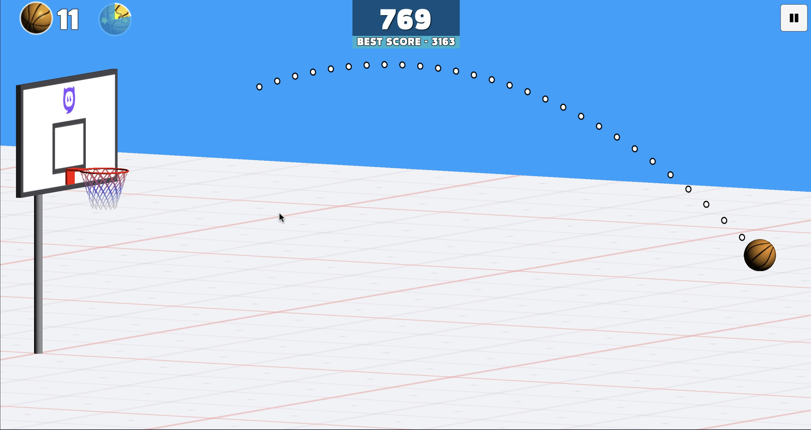
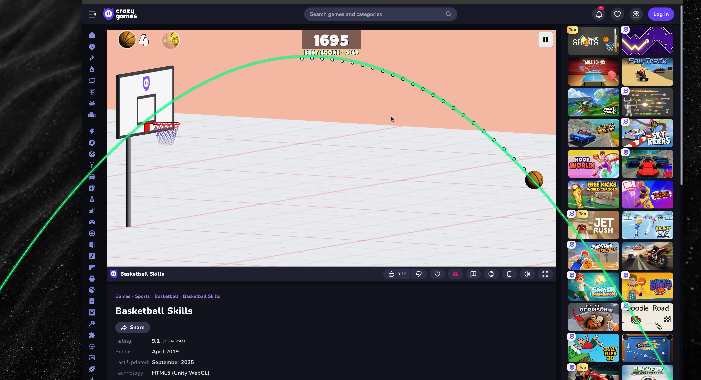

# 🏀 Parabola Extender (포물선 연장기)

Parabola Extender는 웹 브라우저나 데스크탑 화면에 나타나는 미완성된 점선 포물선을 실시간으로 감지하여, 이를 완벽한 기하학적 포물선으로 연장해 투명 오버레이로 그려주는 Python 애플리케이션입니다. 특히 농구 게임과 같이 궤적 예측이 필요한 환경에 최적화되어 있습니다.

## ✨ 주요 기능

- **실시간 화면 캡처**: `mss` 라이브러리를 사용해 지정된 영역을 고속으로 캡처합니다.
- **정밀한 객체 감지**: 
  - **Top-Hat 변환**: 배경색(흰색, 파란색 등)에 방해받지 않고 "검정 테두리가 있는 흰색 점"을 정확히 추출합니다.
  - **HSV 컬러 마스킹**: 갈색 공(Ball)의 위치를 실시간으로 추적합니다.
- **기하학적 곡선 피팅**: 감지된 점들을 바탕으로 $y = ax^2 + bx + c$ 2차 회귀식을 계산합니다.
- **투명 네온 오버레이**: 
  - PyQt5를 이용해 마우스 클릭을 통과시키는 투명 창을 생성합니다.
  - 미완성된 궤적을 앞뒤로 길게 연장하여 매끄러운 실선으로 시각화합니다.
- **컨트롤 패널**: FPS 조절, 연장 길이(%), 평활화(Alpha), 감지 민감도 등을 실시간으로 튜닝할 수 있습니다.

  !

  

## 🛠 기술 스택

- **언어**: Python 3.10+
- **GUI & Overlay**: PyQt5
- **이미지 처리**: OpenCV (OpenCV-Python)
- **수치 계산**: NumPy
- **화면 캡처**: mss
- **시스템 모니터링**: psutil

## 🚀 설치 및 실행 방법

### 1. 의존성 설치
터미널(또는 CMD)에서 아래 명령어를 입력하여 필요한 라이브러리를 설치합니다.
```bash
pip install -r requirements.txt
```

### 2. 앱 실행
```bash
python main.py
```

## 📖 사용 방법

1. **영역 선택**: 앱 실행 후 `Select Region` 버튼을 누르고, 화면에서 포물선과 공이 나타나는 영역을 드래그하여 지정합니다.
2. **시작**: `Start ▶` 버튼을 누르면 오버레이 모드가 활성화됩니다.
3. **궤적 생성**: 브라우저에서 마우스를 조작하여 점선 포물선이 나타나면, 앱이 즉시 이를 포착하여 연장된 실선을 그려줍니다.
4. **설정 조절**:
   - **Extension %**: 포물선을 얼마나 더 길게 연장할지 결정합니다.
   - **Smoothing**: 곡선이 떨리는 현상을 방지하기 위해 평활화 강도를 조절합니다.
   - **Canny/Threshold**: 배경 대조에 따라 점을 더 잘 찾도록 민감도를 조절합니다.

## 📂 프로젝트 구조

```text
parabola_extender/
├── main.py           # 애플리케이션 진입점 및 조정 레이어
├── capture.py        # QThread 기반 실시간 캡처 루프
├── detector.py       # OpenCV 기반 점 및 객체 감지 알고리즘
├── fitter.py         # NumPy 기반 2차 곡선 회귀 및 평활화
├── overlay.py        # PyQt5 투명 오버레이 렌더링 창
├── controls.py       # 사용자 컨트롤 패널 및 영역 선택 도구
└── requirements.txt  # 의존성 라이브러리 목록
```

## ⚠️ 주의 사항 (macOS)
- 본 앱은 macOS의 Space 전환 문제를 방지하기 위해 네이티브 전체화면 대신 좌표 기반 오버레이를 사용합니다.
- 시스템 설정의 **[보안 및 개인정보 보호 > 화면 기록]** 권한에 실행 중인 터미널이나 Python이 허용되어 있어야 정상적으로 캡처가 가능합니다.

---
Developed by Gemini CLI Agent.
